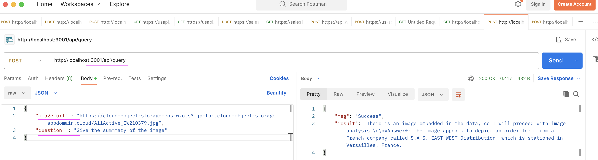
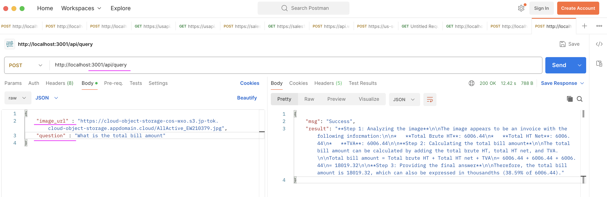

# Using MutliModel LLM in watsonx.ai

This application helps to acccess the  MutliModel LLM that Handles both image and text inputs, outputting text-based responses using the Watsonx.ai

## Prerequisite

Python 3.x should be installed and available.

## 1. Installation

#### 1.1 Download this repo

1. Download this repo (https://github.com/GandhiCloudLab/watsonx-ai-with-multimodal-llm). 

2. Let's assume the repository has been downloaded, and available in the location `/Users/xyz/watsonx-ai-with-multimodal-llm`.

    Let's call this as a root folder.

    Don't forget to replace the `/Users/xyz/watsonx-ai-with-multimodal-llm` with your folder structure, wherever we refer in this document.

#### 1.2 Create Python virtual environment

1. Open a new command or terminal window.

2. Goto the repository root folder by running the below command.

    **Note:** Don't forget to replace the `/Users/xyz/watsonx-ai-with-multimodal-llm` with your folder structure.

    ```
    cd /Users/xyz/watsonx-ai-with-multimodal-llm
    ```

3. Create python `virtual environment` by running the below command.

    ```
    python -m venv myvenv-multimodel-service
    source myvenv-multimodel-service/bin/activate
    ```

4. Install the required python packages by running the below command.
    ```
    python -m pip install -r requirements.txt
    ```

#### 1.3 Create .env file

1. Create `.env` file with the below entries (you should be still in the root folder of the repo /Users/xyz/watsonx-ai-with-multimodal-llm )

```
LOGLEVEL = DBEUG

TEMP_FOLDER = "/Users/gandhi/GandhiMain/990-Temp/test"

WATSONX_CREDENTIALS_URL = "https://us-south.ml.cloud.ibm.com"
WATSONX_API_KEY = "xxxxxx"
WATSONX_PROJECT_ID = "53302198-522e-49a6-ba45-b445d46db666"
WATSONX_MODEL_ID = "meta-llama/llama-3-2-90b-vision-instruct"
```

2. Update the `WATSONX_` properties with your data.

#### 1.4 Start the Python app

1. Run the below commands to start the app

    ```
    python ./src/main.py
    ```

2. Verify the app is working by opening the url  http://localhost:3001 in your browser.

## 2 Using the API

1. The API exposed by this application is http://localhost:3001/api/query

2. You can post the below json into this API
```
{
    "image_url" : "https://cloud-object-storage-cos-wxo.s3.jp-tok.cloud-object-storage.appdomain.cloud/AllActive_EW210379.jpg",
    "question" : "What is the total bill amount"
}
```

3. Here is the sample Curl scripts.

#### Sample 1 : 
```
curl --location 'http://localhost:3001/api/query' \
--header 'Content-Type: application/json' \
--data '{
    "image_url" : "https://cloud-object-storage-cos-wxo.s3.jp-tok.cloud-object-storage.appdomain.cloud/AllActive_EW210379.jpg",
    "question" : "Give the summmary of the image"
}'
```

#### Sample 2 : 
```
curl --location 'http://localhost:3001/api/query' \
--header 'Content-Type: application/json' \
--data '{
    "image_url" : "https://cloud-object-storage-cos-wxo.s3.jp-tok.cloud-object-storage.appdomain.cloud/AllActive_EW210379.jpg",
    "question" : "What is the total bill amount"
}'
```

4. You can also use the postman to call this api.
    

    


## 3. Starting the App using Docker / Podman


### 3.1 Starting the App

This document provides instructions on how to start this app using Docker / Podman.

1. In the terminal window, run the below command after replacing the xxxxxxx with Watsonx API Key.

```
export WATSONX_API_KEY=xxxxxxx
```

2. Run the below command start the docker container.

**Mac :**

    ```
    docker run -d -p 3001:3001 --name mmllm-svc \
        --env LOGLEVEL=DEBUG \
        --env WATSONX_API_KEY=$WATSONX_API_KEY \
        gandigit/mmllm-svc-mac:latest
    ```

**Linux :**

    ```
    docker run -d -p 3001:3001 --name mmllm-svc \
        --env LOGLEVEL=DEBUG \
        --env WATSONX_API_KEY=$WATSONX_API_KEY \
        gandigit/mmllm-svc-linux:latest
    ```
    
- To run the same using `Podman` instead of `Docker`, you need to change the  `docker` into `podman` in the above command.

3. Open this url (http://localhost:3001/hello) in the browser to see if it is working .

### 3.2 Stop the App (for info only)

Run the below commands one by one to stop the apps.

```
docker stop mmllm-svc
docker mmllm-svc

```

### 3.3 View App logs (for info only)

Run the below commmand to view the logs of the apps.

```
docker logs mmllm-svc

```